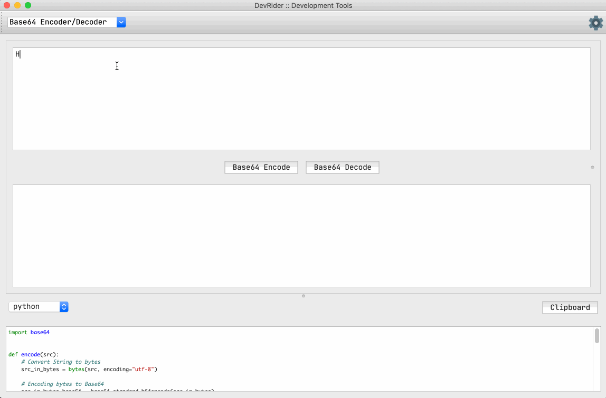

## DevRider

     

There is a serious problem with the state of simple development tools on the internet. 
Most of the websites providing simple encoders/decoders/formatters/prettifiers are filled with ads and popups which makes it difficult and risky to use.
And then there is also a huge problem with privacy and leaking any private data that is used on any of these websites.

[DevRider](https://github.com/namuan/dev-rider) is an attempt to provide a desktop tool which includes a shell and addins for various utilities.

#### Features

🚀 No Ads, Lean, Open Source

🚀 Curated code samples

🚀 Scratch Pad

#### Bundled Tools/Utilities

🚀 Base64 Encoder/Decoder

🚀 URL Encoder/Decoder

🚀 Markdown Viewer

🚀 JSON Viewer/Formatter/Minifier [Demo](docs/features/json-viewer.md)

#### Getting started

See [Contributing](docs/contributing.md)
