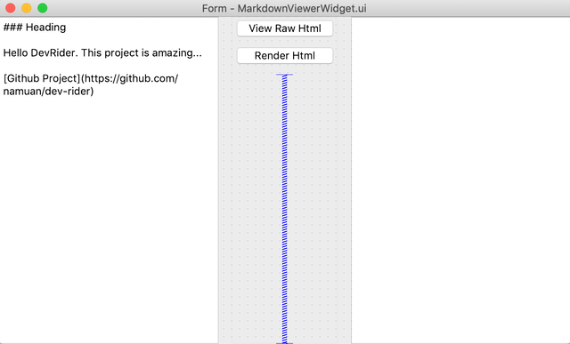
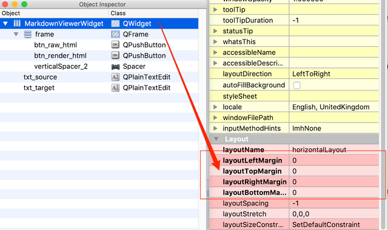
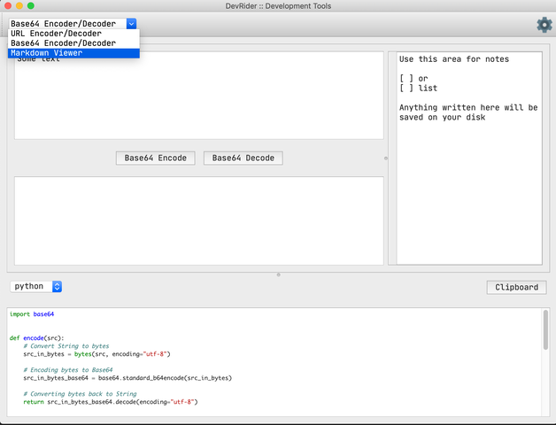
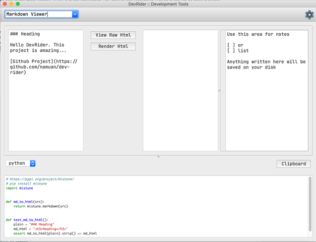

## Adding new tool/utility
---

This guide will explain the process of adding a new tool in DevRider. We will add a Markdown Viewer as part of this process.

There are a couple of things that we need to add.

### Adding User Interface for Markdown Viewer:

I usually start with copying an existing widget from `resources/views` to a new file.

`cp resources/views/Base64EncoderWidget.ui resources/views/MarkdownViewerWidget.ui`

Next, let's load the new file in [Qt Designer](https://build-system.fman.io/qt-designer-download) and create the user interface.



Make sure that you remove the margins from the top level layout to avoid some gaps when the widget is added in the main window.



Save the UI when completed and run `make uic` command to generate the `*ui.py` file in the `app/generated` folder.

```
$ make uic
$ ls -l app/generated/Markdown*_ui.py
-rw-r--r--  1 nmn  staff  2781 20 Jan 11:06 app/generated/MarkdownViewerWidget_ui.py
```


Next, we'll create a plugin file for this and link the view with the button handlers. 

```
# Create a folder to group any related files
$ mkdir -vp app/tools/markdown
$ touch app/tools/markdown/markdown_viewer.py
```

In this file, we'll define a class inheriting from `ToolPlugin` class.

> Remember this class name as it'll be used for looking up code snippets for the markdown viewer.

```python

class MarkdownViewer(ToolPlugin):
    def __init__(self): # 1
        super().__init__(
            name="Markdown Viewer", # 2
            widget_class=MarkdownViewerWidget # 3
        )
```

(1) name = "What will appear in the Toolbar"
(2) widget_class = Name of the UI class to display when this tool is selected. We'll add this Widget class later

The next thing to do is to override `bind_events` method to connect the UI signals.

```python
def bind_events(self):
        self.view.btn_render_html.pressed.connect(self.on_render_html)
        self.view.btn_raw_html.pressed.connect(self.on_raw_html)
```

And here are the two signalled methods for completion

```
def on_render_html(self):
        markdown_html = self.md_to_html(self.view.txt_source.toPlainText())
        self.view.txt_target.clear()
        self.view.txt_target.appendHtml(markdown_html)

    def on_raw_html(self):
        markdown_html = self.md_to_html(self.view.txt_source.toPlainText())
        self.view.txt_target.clear()
        self.view.txt_target.setPlainText(markdown_html)

    @staticmethod
    def md_to_html(md):
        return mistune.markdown(md)
```

You can see the whole class [here](https://github.com/namuan/dev-rider/blob/master/app/tools/markdown/markdown_viewer.py).

Now that we have defined the glue code, let's add this in the list of modules to load. The following will go in `app/tools/__init__.py`

```
from .markdown import markdown_viewer

tool_plugins = {
    ...
    'markdown_viewer': markdown_viewer
}
```

#### Adding Widget class

In the glue code, we defined the widget class which we are going to add here. This class is there to use the generated class from the file that we saved from Qt Designer.

```
$ touch app/views/markdown_viewer_widget.py
```

And the class definition will look this

```
from PyQt5 import QtWidgets

from app.generated.MarkdownViewerWidget_ui import Ui_MarkdownViewerWidget


class MarkdownViewerWidget(QtWidgets.QWidget, Ui_MarkdownViewerWidget):
    def __init__(self, parent=None):
        super(MarkdownViewerWidget, self).__init__(parent)
        self.setupUi(self)

```

That should be it to load the tool in the main window. If you run the application, you should see Markdown Viewer in the list of tools available.



Which should load the UI when selected




In the next section, we'll look at how to add code snippets which can be used to convert plain text into Markdown Html.